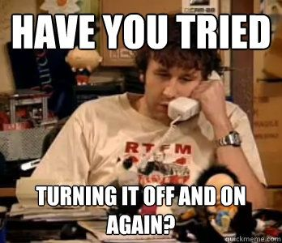

---
output: 
  slidy_presentation:
    font_adjustment: +2
    footer: "Introduction to R for Air Quality Applications - Webinar 1 - April 7, 2020 - MARAMA"
    theme: simplex
---


# R for Air Quality - Introduction  

 - Webinar 1: A General Introduction to R - Today
    - Jenny St. Clair, Environmental Data Specialist, MARAMA
 - Webinar 2: tidyverse - Thurs 4/9/20 - 2-3:30 EST
    - Shane Cone, Environmental Scientist, DE DNREC DAQ
 - Webinar 3: OpenAir - Thurs 4/16/20 - 3:30-5 EST
    - Keith Hoffman, Environmental Scientist, DE DNREC DAQ
 - Webinar 4: ggplot2 - Thurs 4/23/20 - 3:30-5 EST
    - Shane Cone, DE and Jenny St. Clair, MARAMA


# Q & A 


-   Please submit questions in the question box on the GoToWebinar Side Panel.
-   We will answer as many questions as possible during this webinar. If we can't get to your question during the webinar, we'll respond via email.


# 2 Quick Poll Questions


# Overview

-   About R
-   Pros and Cons
-   Coding in R
    -   RStudio
    -   Scripts.R
    -   Use R as a Calculator
    -   Functions
    -   Object names
    -   Importing data
    -   Calling columns in a dataframe with $
    -   Storing variables, temporary objects
    -   Data types
    -   Data structures
    -   Missing values - NA
    -   Logical operators
    -   Packages
-   Best practices
    -   RMarkdown.Rmd
    -   R Projects vs. working directories
    -   Debugging - 5 Steps (Jenny Bryan's talk)
- Where to get help
- Questions?
- Exercise

Garrett Grolemund and Hadley Wickham's book, "R for Data Science" was instrumental in developing this webinar series. <https://r4ds.had.co.nz/>


# About R

-   Statistical programming language
-   High-level
-   Versatile, robust
-   Packages
-   Useful for both data preparation and data analysis
-   Open source
    -   Meaning: source code is freely available to the public, the public can contribute
-   Free


# Pros
-   R can handle larger files
-   Excel is a spreadsheet tool, errors hide
-   Reproducability, transparency
-   Advanced and versatile statistics
-   Customizable data visualizations


# Cons
-   R has a steep learning curve
-   If colleagues don't know R, this can hinder collaboration

 
 
 
 
 

# Different (neutral)
-   R has less formal support, but virtually endless online user community forums


# RStudio 
An Integrated Development Environment (IDE) for R


# Scripts.R 


# Scripts.R 


 You can make a line into a comment by typing \# in front. This is how you can add plain text or non-executable code.


# Use R as a calculator

    400 * 3 + 55.889
    
    2 ^ 8

 - You can enter these into the console and get a result, but what if you want to store the result?

# Objects

 - An "object" is something that contains information.
 - You can create new objects with &lt;- (which reads "gets")

Example
    
    objectName <- value
    
    someText <- "Hello World"
    
    print(someText)

 - Give objects short and meaningful names.
 - You can see objects you've created in the upper righthand side of RStudio--the Environment window


# Object Names

-   Must start with a letter
-   Can contain \_ and .
-   Descriptive
-   Some people use snake\_case, others prefer camelCase.
-   Best practice: be consistent with naming conventions.

Example:

    my_text <- "Hello World"


# 2 Quick Poll Questions


# Functions

R has many functions built in. These are referred to as Base R functions. When you call a function, it looks like this:

    function_name( arg1 = val1, arg2 = val2 )

You can create a function, but that's beyond the scope of our training. You will see many examples of functions as we move forward.


# Importing data

-   CSV's are the best file format
-   Other delimited files are fine too
-   excel workbook files can import but will complicate things

Syntax:

      oz_mar <- read_csv("march_ozone.csv")

Now we have a dataframe stored in the object oz\_mar.

-   Paths to these files is necessary if you are not already pointed to your working directory (more on this later!)
-   Many other arguments are available to specify things like whether there is a header, or if the delimiter is something other than a comma
    -   <https://readr.tidyverse.org/reference/read_delim.html>
    -   <http://rprogramming.net/read-csv-in-r/>


# Calling columns in a dataframe with $

Example:

    oz_mar$value

This would pick out the column titled "value" within the oz\_mar dataframe.


# Data types

-   Character "Hello World"
-   Numeric (real or decimal) 3.14159
-   Integer 7
-   Logical TRUE


# Data structures

Atomic vector: the most basic data structure

    c(1, 4, 6, 2, 3)
    c("hello", "world", "its", "me", "jenny")

List: similar to a vector, but it can store different data types

    list(1, "hello", TRUE, 3.141)

Matrix: the simplest 2-dimensional data structure

    matrix(c("a", "b", "c"), nrow = 3, ncol = 4)

Data frame: similar to matrices, tightly coupled collections of variables

Factors: a vector with ordered levels, helpful with categorical data


# Missing values - NA

-   R knows what a missing value is (when it's represented with NA)
-   For automatic recognition of missing values, use NA
-   Sometimes NA will be the output when an operation doesn't make sense


# Logical operators

You will need to use logical operators when sub-setting data and in if-statements when your scripts get more complex (we will not cover if-statements in this training)

- "not" = !
- "and" for vectors &gt; length-1 = &
- "and" for single, scalar objects = &&
- "or" for vectors &gt; length-1 = |
- "or" for single, scalar objects = ||
- exclusive "or" = xor(x, y)
- is.NA() checks if an object is NA and returns TRUE or FALSE


# Packages
-   Contain numerous functions that help you complete specialized tasks
-   Anyone can make one
-   The reason R is so versatile and robust
-   Tidyverse
-   Openair
-   Many, many more

## Installation:

``` r
# not run
install.packages("tidyverse")
```

## Call a package:

``` r
library(tidyverse)
```

    ## Warning: package 'tidyverse' was built under R version 3.6.3

    ## -- Attaching packages --------------------------------------------------------------------------------------------------------------------------------- tidyverse 1.3.0 --

    ## v ggplot2 3.3.0     v purrr   0.3.3
    ## v tibble  2.1.3     v dplyr   0.8.3
    ## v tidyr   1.0.0     v stringr 1.4.0
    ## v readr   1.3.1     v forcats 0.4.0

    ## Warning: package 'ggplot2' was built under R version 3.6.3

    ## -- Conflicts ------------------------------------------------------------------------------------------------------------------------------------ tidyverse_conflicts() --
    ## x dplyr::filter() masks stats::filter()
    ## x dplyr::lag()    masks stats::lag()


# Best practices: RMarkdown files (.Rmd)


# Best practices: R Projects vs. working directories

 - Many people set a "working directory" for every project using setwd()
 - This is problematic. 
 - File organization is different on different computers.
 - If there were ever a pandemic that lead to mass teleworking, suddenly you'd need to change all your working directories to match your home computer by hand.
 - The solution: a Project-Oriented Workflow!

 - For more on this: https://rstats.wtf/index.html


# R Projects 


# Best practices: Problem-solving in R

A quick summary of Jenny Bryan's RStudio::conf 2020 talk, "object of type closure is not subsettable" (which you should definitely watch!)
See: https://github.com/jennybc/debugging 

# 1. Reset 
  - Restart R
  - Set your global options in RStudio to NEVER save .RData on exit 
  - https://rstats.wtf/index.html
  
# 2. Reprex, AKA minimum reproducible example
  - Stripping away all the "extra" stuff to isolate/recreate the bug
  - No extra packages, no unecessary functions, inputs are small and simple
  - Can be tricky

# 3. Debug
  - R has a built in debugger. This may come in handy later on down the line. 
  - Jenny Bryan's talk includes more detail on how to approach this.
  
# 4. Deter
  - Prevent a problem by adding built-in checks that can tell you what's wrong.
  
  
  
  
  
  
# Where to get help?
 1. Check the R Documentation to be sure you're doing things by the book: https://www.rdocumentation.org/
 2. See if a there is a forum that answers your question already.
    - https://stackoverflow.com/questions/tagged/r
    - https://community.rstudio.com/
 3. If you can't find the answer online and want to ask the internet for help:
    - Create a reprex that someone else could run (keep it simple!! use fake or built-in data)
    - The friendliest place for beginners: https://community.rstudio.com/
    - Stackoverflow can be unfriendly if you don't have a reprex or if your question has been answered already in another post--you've been warned :)
    
    


# Questions?


    
    
    
    
# Exercise: Get a project started in R.

 1. Create a new R Project (start a new directory).
 2. Create and save a new R Script in the folder.
    - In this R Script, try using R as a calculator. You can run each line individually by placing your cursor on the line and pressing Ctrl + Enter (windows) or Command + Enter (Mac). 
 3. Create and save a new RMarkdown file in the folder. 
    - Read the text that pre-populates in the new RMarkdown file.
    - Click on "Knit."
    - Delete all pre-populated text in the file except the YAML header at the top.
    - create an R chunk by typing the following:
  
    - Load tidyverse.
    - Save a csv in your project folder (preferrably something with a standard format - single line header)
    - Read the csv into R.
  4. For more guidance and exercises: https://r4ds.had.co.nz/ 


# Thank you!

We will send out a link to the recording of this webinar, so stay tuned!

Please feel free to email with any questions.

 - Website: www.marama.org 
 - Email: jstclair@marama.org
 - GitHub: @geojenn